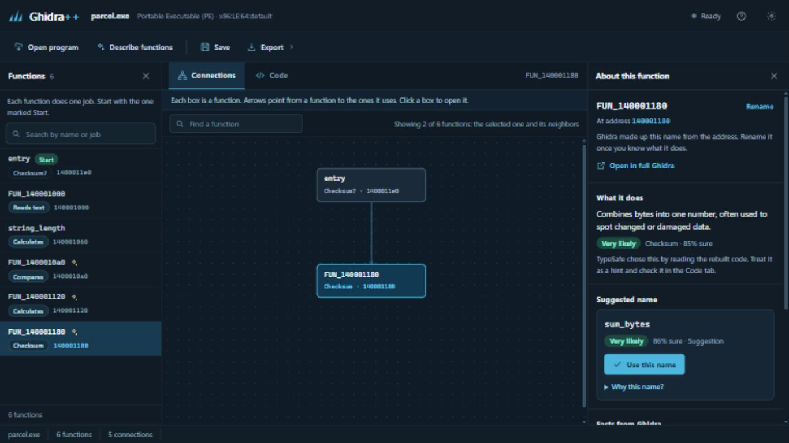

# Ghidra++

Automatic reverse engineering, built on [Ghidra](https://github.com/NationalSecurityAgency/ghidra).

Ghidra++ opens a compiled program, the kind of file you double-click to run, and shows you what is inside without running it. Ghidra splits the program into functions and rebuilds readable C code. The browser workspace lists each function's facts in plain words. With a TypeSafe API key, it also says what each function seems to do and suggests a name when a common one fits. You decide which suggestions to keep.

For example, click **Try the example** to open the included [`parcel.exe`](Ghidra/Features/GhidraPlusPlus/examples/parcel.exe), start at the function marked **Start**, and find the one that contains `Parcel priority delivery`. Check a suggested name against [`parcel.c`](Ghidra/Features/GhidraPlusPlus/examples/parcel.c), then use it or undo it.

## Get started

Download the Windows ZIP from [v0.2.0](https://github.com/Cuuper22/ghidra-plus-plus/releases/tag/v0.2.0), extract it, and double-click `ghidra-plus-plus.bat`. It includes Ghidra 12.1.4 and Java 25, and the workspace opens in your browser. [Getting Started](docs/getting-started.md) walks through the example, the key setup, and saving your work. To build from source, see the [contributor guide](docs/contributing.md).

Click **Open in full Ghidra** to work on a function in Ghidra's classic CodeBrowser, and **Tools → Ghidra++ → Open Investigation** to come back. Both windows use the same program. Projects are saved in `Documents/Ghidra++ Projects` under your home folder.

Opening a program, the connections between functions, and the rebuilt code all work without a key. Descriptions and names come from [TypeSafe Jev](https://typesafe.ai/), which receives short excerpts of each function's code; check its site for current pricing. The key is kept only while Ghidra++ runs and is never saved in the project.

## Current scope

- Ghidra handles import, disassembly, decompilation, inferred types, project storage, and the classic tools.
- Jev picks one of 16 kinds of jobs for each function, including "unclear", and may pick a name from a short list of common names. It cannot invent names, so many functions get a description and no name. [How It Works](docs/how-it-works.md#how-well-it-works) shows how often it was right in a small test.
- You can use or undo a suggestion, rename functions yourself, save and reopen the project, and export the rebuilt C or an analysis report. The rebuilt C is Ghidra's reconstruction, not the original source, and may not compile.
- A [local MCP adapter](Ghidra/Features/GhidraPlusPlus/tools/mcp.py) lets AI agents inspect and review the same project. A batch mode writes `analysis.json` and `reconstructed.c` without opening the browser.

Custom AI structure recovery and model training are future work. See [How It Works](docs/how-it-works.md) for the pipeline and [Contributing](docs/contributing.md) for development.

Ghidra++ is a fork of NSA Ghidra. The [upstream README](docs/upstream-readme.md), upstream license, and original attribution remain available.
